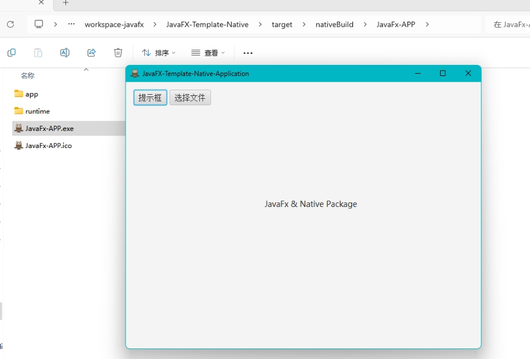

## JavaFX-Template-Native
- 集成jfoenix、commons-math、commons-lang3、netty，方便一些和底层做通信使用，不需要可以自行pom中去掉依赖
- 当前使用的jdk17，理论上jdk14+都支持
- 采用模块化，支持一键打包生成很小的exe（目前30M，不带依赖也就20M左右）
- maven构建
    
---


# 介绍

> 项目灵感来源[javafx-boot](https://gitee.com/westinyang/javafx-boot?_from=gitee_search)，对于新的jdk，项目无法直接生成exe，所以研究了一下，发现jdk其实一直在优化gui方面的打包，从jdk14已经原生支持native打包了，并且将虚拟机以模块打包进exe，这将给java开发者带来极大的便利，当然也是支持一键打包MAC等

# 打包
- 绿色版 mvn clean javafx:jlink exec:exec@image
- 安装包 mvn clean javafx:jlink exec:exec@installer

- 注意事项，修改pom.xml中javahome路径以及名称

```
    <!--JAVA_HOME路径-->
    <javahome.path>D:/myProgram/jdk-17.0.7</javahome.path>
    <!-- 打包、镜像 统一名称 -->
    <pkg.imagename>JavaFx-APP</pkg.imagename>
    <!-- 厂商 -->
    <pkg.vendor>xxx有限公司</pkg.vendor>
    <!-- 描述 -->
    <pkg.description>JavaFx-APP-Demo</pkg.description>
    <!-- 版权 -->
    <pkg.copyright>rocoplayer.com</pkg.copyright>
    <!-- 版本号 -->
    <pkg.version>1.0.0</pkg.version>
```

```
注意，由于是模块化，有些第三方库需要open或者export，当需要配置options的时候，打包插件中的java-options也要保持一样，java-options等于是exe运行时的参数。

如需要打包MAC，自行将
<argument>-t</argument>
<argument>exe</argument>
改成需要的格式，参考jdk的jpackage支持的打包格式
```


- 启动应用 `.\target\nativeBuild\*.exe`

# 项目配置（app.properties）

```properties
title=JavaFX-Template-Native-Application
icon=icon/icon.png
stage.width=640
stage.height=440
stage.resizable=true
```

# 其他版本分支
```
需要引入javacv版本的请查看javacv分支
```


# 项目截图


# 参与贡献

1.  Fork 本仓库
2.  新建 Feat_xxx 分支
3.  提交代码
4.  新建 Pull Request
